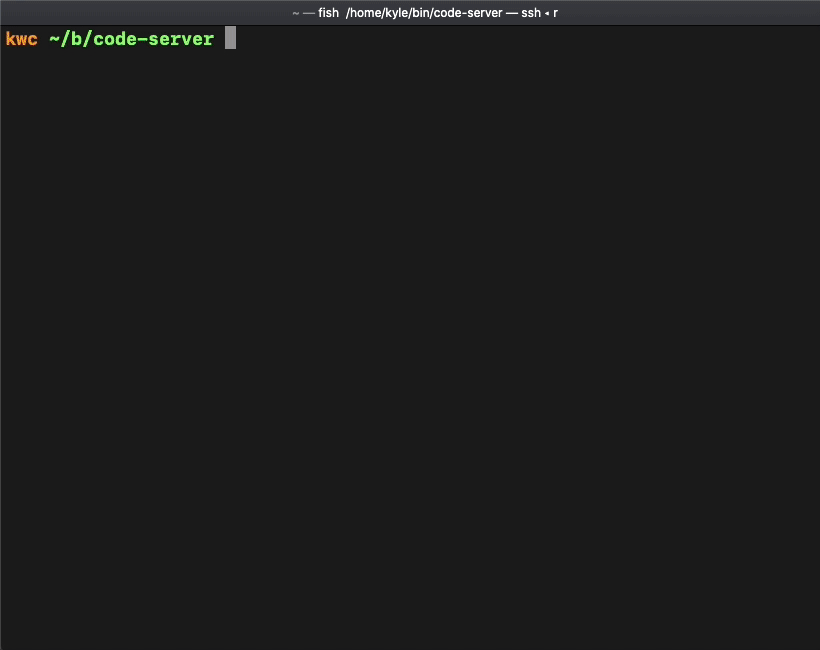

# code-server

Run [VS Code](https://github.com/Microsoft/vscode) on any machine anywhere and access it in the browser.

- **Code everywhere:** Code on your Chromebook, tablet, and laptop with a
  consistent dev environment. Develop on a Linux machine and pick up from any
  device with a web browser.
- **Server-powered:** Take advantage of large cloud servers to speed up tests, compilations, downloads, and more.
  Preserve battery life when you're on the go since all intensive tasks runs on your server.
  Make use of a spare computer you have lying around and turn it into a full development environment.



## Getting Started

For a full setup and walkthrough, please see [./doc/guide.md](./doc/guide.md).

## Install

You can easily and securely install code-server with our install script on any Linux or macOS machine.

```bash
# First run to print out the install process.
curl -fsSL https://code-server.dev/install.sh | sh  -s -- --dry-run
# Now it will actually install.
curl -fsSL https://code-server.dev/install.sh | sh
```

```
$ curl -fsSL https://code-server.dev/install.sh | sh  -s -- --dry-run --help

$0 [--dry-run] [--version X.X.X] [--static <install-prefix>=~/.local]

Installs latest code-server on any macOS or Linux system preferring to use the OS package manager.

  curl -fsSL https://code-server.dev/install.sh | sh -s --

- For Debian, Ubuntu, Raspbian it will install the latest deb package.
- For Fedora, CentOS, RHEL, openSUSE it will install the latest rpm package.
- For Arch Linux it will install the AUR package.
- For any unrecognized Linux operating system it will install the latest static release into ~/.local
  - Add ~/.local/bin to your \$PATH to run code-server.

- For macOS it will install the Homebrew package.
  - If Homebrew is not installed it will install the latest static release into ~/.local
  - Add ~/.local/bin to your \$PATH to run code-server.

- If ran on an architecture with no binary releases or glibc < v2.17, it will install the
  npm package with yarn or npm.
  - We only have binary releases for amd64 and arm64 presently.

    --dry-run Enables a dry run where where the steps that would have taken place
              are printed but do not actually execute.

    --version Pass to install a specific version instead of the latest release.

    --static  Forces the installation of a static release into ~/.local

              This flag takes an optional argument for the installation prefix which defaults to "~/.local".
              code-server will be unarchived into ~/.local/lib/code-server.X.X.X and the binary will be symlinked
              into "~/.local/bin/code-server". You will need to add ~/.local/bin to your \$PATH to use it without
              the full path.

              To install system wide set the prefix to /usr/local.
```

If you still don't trust our install script, even with the above explaination and the dry run, we have
docs in [./doc/install.md](./doc/install.md) that explain how to install `code-server` on a variety of
platforms. The script runs the exact same commands.

### Docker

```bash
# This will start a code-server container and expose it at http://127.0.0.1:8080.
# It will also mount your current directory into the container as `/home/coder/project`
# and forward your UID/GID so that all file system operations occur as your user outside
# the container.
docker run -it -p 127.0.0.1:8080:8080 \
  -v "$PWD:/home/coder/project" \
  -u "$(id -u):$(id -g)" \
  codercom/code-server:latest
```

You should also check out

## FAQ

See [./doc/FAQ.md](./doc/FAQ.md).

## Contributing

See [./doc/CONTRIBUTING.md](./doc/CONTRIBUTING.md).

## Enterprise

Visit [our website](https://coder.com) for more information about our
enterprise offerings.
