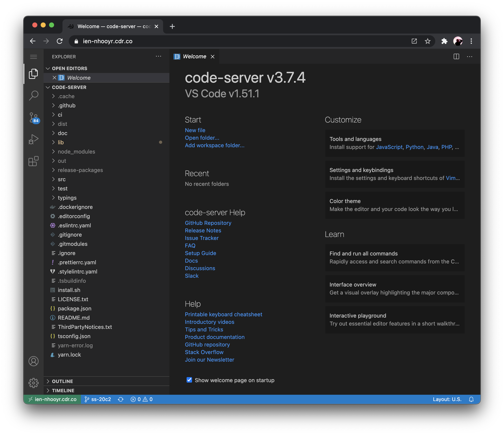

# code-server &middot; [](https://github.com/cdr/code-server/discussions) [](https://cdr.co/join-community) [](https://twitter.com/coderhq)


Run [VS Code](https://github.com/Microsoft/vscode) on any machine anywhere and access it in the browser.



## Highlights

- Code on any device with a consistent development environment
- Use cloud servers to speed up tests, compilations, downloads, and more
- Preserve battery life when you're on the go; all intensive tasks run on your server

## Requirements

For a good experience, we recommend at least:

- 1 GB of RAM
- 2 cores

You can use whatever linux distribution floats your boat but in our [guide](./docs/guide.md) we assume Debian on Google Cloud.

## Getting Started

There are two ways to get started:

1. Using the [install script](./install.sh), which automates most of the process. The script uses the system package manager (if possible)
2. Manually installing code-server; see [Installation](./docs/install.md) for instructions applicable to most use cases

If you choose to use the install script, you can preview what occurs during the install process:

```bash
curl -fsSL https://code-server.dev/install.sh | sh -s -- --dry-run
```

To install, run:

```bash
curl -fsSL https://code-server.dev/install.sh | sh
```

When done, the install script prints out instructions for running and starting code-server.

We also have an in-depth [setup and configuration](./docs/guide.md) guide.

### Cloud Program ☁️

We're working on a cloud platform that makes deploying and managing code-server easier.
Consider running code-server with the beta flag `--link` if you don't want to worry about

- TLS
- Authentication
- Port Forwarding

```bash
$ code-server --link
Proxying code-server to Coder Cloud, you can access your IDE at https://valmar-jon.cdr.co
```

## FAQ

See [./docs/FAQ.md](./docs/FAQ.md).

## Want to help?

See [CONTRIBUTING](./docs/CONTRIBUTING.md) for details.

## Hiring

We ([@cdr](https://github.com/cdr)) are looking for engineers to help [maintain
code-server](https://jobs.lever.co/coder/e40becde-2cbd-4885-9029-e5c7b0a734b8), innovate on open source, and streamline dev workflows.

Our main office is in Austin, Texas. Remote is ok as long as
you're in North America or Europe.

Please get in [touch](mailto:jobs@coder.com) with your resume/GitHub if interested.

## For Organizations

Visit [our website](https://coder.com) for more information about remote development for your organization or enterprise.
