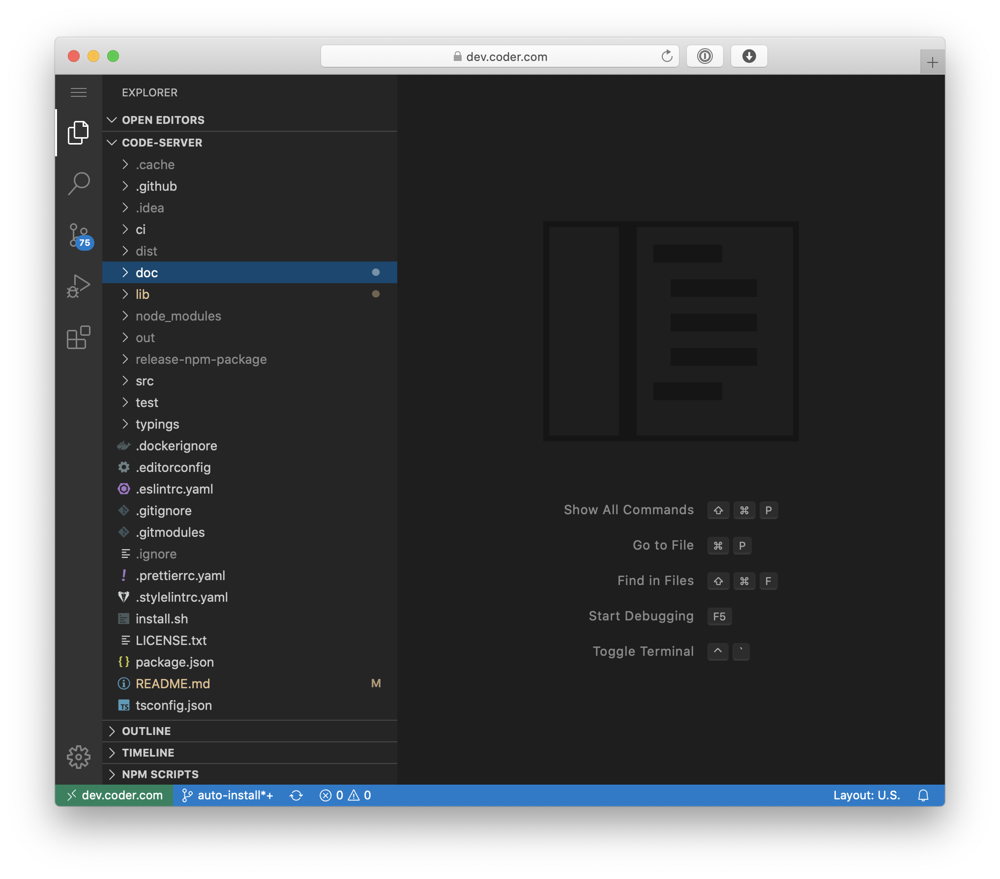

# code-server &middot; [](https://github.com/cdr/code-server/discussions) [](https://cdr.co/join-community) [](https://twitter.com/coderhq)

Run [VS Code](https://github.com/Microsoft/vscode) on any machine anywhere and access it in the browser.



## Highlights

- **Code everywhere**
  - Code on your Chromebook, tablet, and laptop with a consistent development environment.
  - Develop on a Linux machine and pick up from any device with a web browser.
- **Server-powered**
  - Take advantage of large cloud servers to speed up tests, compilations, downloads, and more.
  - Preserve battery life when you're on the go as all intensive tasks run on your server.
  - Make use of a spare computer you have lying around and turn it into a full development environment.

## Getting Started

For a full setup and walkthrough, please see [./doc/guide.md](./doc/guide.md).

### Quick Install

We have a [script](./install.sh) to install code-server for Linux, macOS and FreeBSD.

It tries to use the system package manager if possible.

First run to print out the install process:

```bash
curl -fsSL https://code-server.dev/install.sh | sh -s -- --dry-run
```

Now to actually install:

```bash
curl -fsSL https://code-server.dev/install.sh | sh
```

The install script will print out how to run and start using code-server.

### Manual Install

Docs on the install script, manual installation and docker image are at [./doc/install.md](./doc/install.md).

### Alpha Program 🐣
We're working on a cloud platform to make deploying and managing code-server easier. If you don't want to worry about

* TLS
* Authentication
* Port Forwarding

consider [joining our alpha program](https://codercom.typeform.com/to/U4IKyv0W).

## FAQ

See [./doc/FAQ.md](./doc/FAQ.md).

## Contributing

See [./doc/CONTRIBUTING.md](./doc/CONTRIBUTING.md).

## Hiring

We ([@cdr](https://github.com/cdr)) are looking for engineers to help maintain
code-server, innovate on open source and streamline dev workflows.

Our main office is in Austin, Texas. Remote is ok as long as
you're in North America or Europe.

Please get in [touch](mailto:jobs@coder.com) with your resume/github if interested.

We're also hiring someone specifically to help maintain code-server.
See the listing [here](https://jobs.lever.co/coder/e40becde-2cbd-4885-9029-e5c7b0a734b8).

## For Organizations

Visit [our website](https://coder.com) for more information about remote development for your organization or enterprise.
