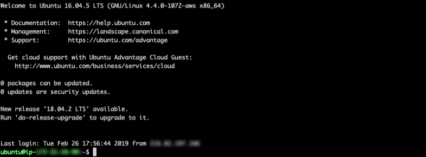

# Deploy on AWS

This tutorial shows you how to deploy `code-server` on an EC2 AWS instance.

If you're just starting out, we recommend [installing code-server locally](../../self-hosted/index.md). It takes only a few minutes and lets you try out all of the features.

---

## Deploy to EC2

### Use the AWS wizard

- Click **Launch Instance** from your [EC2 dashboard](https://console.aws.amazon.com/ec2/v2/home).
- Select the Ubuntu Server 18.04 LTS (HVM), SSD Volume Type
- Select an appropriate instance size (we recommend t2.medium/large, depending on team size and number of repositories/languages enabled), then **Next: Configure Instance Details**
- Select **Next: ...** until you get to the **Configure Security Group** page, then add a **Custom TCP Rule** rule with port range set to `8443` and source set to "Anywhere"
  > Rules with source of 0.0.0.0/0 allow all IP addresses to access your instance. We recommend setting [security group rules](https://docs.aws.amazon.com/AWSEC2/latest/UserGuide/using-network-security.html?icmpid=docs_ec2_console) to allow access from known IP addresses only.
- Click **Launch**
- You will be prompted to create a key pair
    > A key pair consists of a public key that AWS stores, and a private key file that you store. Together, they allow you to connect to your instance securely. For Windows AMIs, the private key file is required to obtain the password used to log into your instance. For Linux AMIs, the private key file allows you to securely SSH into your instance.
- From the dropdown choose "create a new pair", give the key pair a name
- Click **Download Key Pair**
  > This is necessary before you proceed. A `.pem` file will be downloaded. make sure you store is in a safe location because it can't be retrieved once we move on.
- Finally, click **Launch Instances**
---
### SSH Into EC2 Instance
- First head to your [EC2 dashboard](https://console.aws.amazon.com/ec2/v2/home) and choose instances from the left panel
- In the description of your EC2 instance copy the public DNS (iPv4) address using the copy to clipboard button
- Open a terminal on your computer and use the following command to SSH into your EC2 instance
  ```
  ssh -i "path/to/your/keypair.pem" ubuntu@(paste the public DNS here)
  ```
  >example: `ssh -i "/Users/John/Downloads/TestInstance.pem" ubuntu@ec2-3-45-678-910.compute-1.amazonaws.co`
- You should see a prompt for your EC2 instance like so
- At this point it is time to download the `code-server` binary. We will of course want the linux version.
- Find the latest Linux release from this URL:
  ```
  https://github.com/cdr/code-server/releases/latest
  ```
- Replace {version} in the following command with the version found on the releases page and run it (or just copy the download URL from the releases page):
  ```
  wget https://github.com/cdr/code-server/releases/download/{version}/code-server-{version}-linux-x64.tar.gz
  ```
- Extract the downloaded tar.gz file with this command, for example:
  ```
  tar -xvzf code-server-{version}-linux-x64.tar.gz
  ```
- Navigate to extracted directory with this command:
  ```
  cd code-server-{version}-linux-x64
  ```
- If you run into any permission errors, make the binary executable by running:
  ```
  chmod +x code-server
  ```
  > To ensure the connection between you and your server is encrypted view our guide on [securing your setup](../../security/ssl.md)
- Finally, run
  ```
  ./code-server
  ```
- Open your browser and visit `https://$public_ip:8443/` (where `$public_ip` is your AWS instance's public IP address). You will be greeted with a page similar to the following screenshot. Code-server is using a self-signed SSL certificate for easy setup. In Chrome/Chromium, click **"Advanced"** then click **"proceed anyway"**. In Firefox, click **Advanced**, then **Add Exception**, then finally **Confirm Security Exception**.

  > For instructions on how to keep the server running after you end your SSH session please checkout [how to use systemd](https://www.linode.com/docs/quick-answers/linux/start-service-at-boot/) to start linux based services if they are killed

  ---
> NOTE: If you get stuck or need help, [file an issue](https://github.com/cdr/code-server/issues/new?&title=Improve+self-hosted+quickstart+guide), [tweet (@coderhq)](https://twitter.com/coderhq) or [email](mailto:support@coder.com?subject=Self-hosted%20quickstart%20guide).
