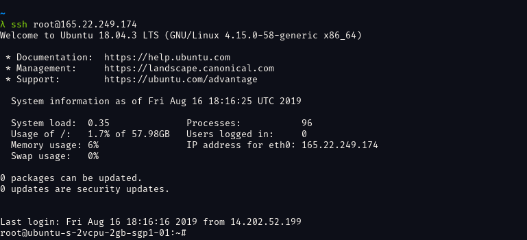

# Deploy on DigitalOcean

This tutorial shows you how to deploy `code-server` to a single node running on DigitalOcean.

If you're just starting out, we recommend
[installing code-server locally](self-hosted-docs). It takes only a few minutes
and lets you try out all of the features locally.

If you get stuck or need help at anytime, [file an issue](create-issue),
[tweet (@coderhq)](twitter-coderhq) or [email](email-coder).

[self-hosted-docs]: ../../self-hosted/index.md
[create-issue]: https://github.com/cdr/code-server/issues/new?title=Improve+DigitalOcean+quickstart+guide
[twitter-coderhq]: https://twitter.com/coderhq
[email-coder]: mailto:support@coder.com?subject=DigitalOcean%20quickstart%20guide

---

### Recommended: Using the Marketplace

[](https://marketplace.digitalocean.com/apps/code-server?action=deploy)

1. On the **Create Droplets** page, choose a plan for your new code-server
   instance. We recommend picking an instance with at least 4 GB of RAM and 2
   CPU cores, or more depending on team size and number of
   repositories/languages enabled.
2. Optionally enable backups and add block storage.
3. Choose the closest available region to your physical location to reduce
   latency.
4. Select an SSH key that you already have in your account, or click **New SSH
   Key** and follow the tutorial on how to make your own SSH key.
5. Click **Create Droplet**, then click on the droplet to expand it.
6. While you're waiting for the droplet to deploy, copy the **IPv4** address.
7. Once the droplet is ready, connect using SSH with the key you specified or
   created earlier. You should be greeted with information on how to access your
   code-server instance and how to view/change the password.
   > You can SSH into your server using PuTTY or by running
   > `ssh root@(paste ipv4 address here)`.
8. In the droplet's terminal, run `cat /etc/code-server/pass` to view the
   code-server password.
9. Open your browser and visit `https://$public_ip` (where `$public_ip`
   is your Droplet's public IP address). You will be greeted with a page similar
   to the following screenshot. code-server is using a self-signed SSL
   certificate for easy setup. In Chrome/Chromium, click **Advanced** then
   click **proceed anyway**. In Firefox, click **Advanced**, then **Add
   Exception**, then finally **Confirm Security Exception**.
   

---

### Using the "Create Droplets" Wizard

If you used the Marketplace to set up code-server, you don't need to follow this
section.

[Open your DigitalOcean dashboard](create-droplet) to create a new droplet.

1. **Choose an image:** Select the **Distributions** tab and then choose
   **Ubuntu 18.04.3 (LTS) x64**.
2. **Choose a size:** We recommend at least 4GB RAM and 2 CPU, or more depending
   on team size and number of repositories/languages enabled.
3. Select an SSH key that you already have in your account, or click **New SSH
   Key** and follow the tutorial on how to make your own SSH key.
4. Click **Create Droplet**, then click on the droplet to expand it.
5. While you're waiting for the droplet to deploy, copy the **IPv4** address.
6. Once the droplet is ready, connect using SSH with the key you specified or
   created earlier. You should be greeted with information on how to access your
   code-server instance and how to view/change the password.
   > You can SSH into your server using PuTTY or by running
   > `ssh root@(paste ipv4 address here)`.
7. If you get a warning about an unknown server key fingerprint, type "yes" to
   approve the remote host.
8. You should see a prompt for your Droplet like so:
   
9. At this point it is time to download the `code-server` binary. We will, of
   course, want the linux version. Find the latest code-server release from the
   [GitHub releases](code-server-latest) page.
10. Right click the Linux x64 `.tar.gz` release asset and copy the URL. In the
    SSH terminal, run the following command:
    ```
    wget (paste the URL here)
    ```
11. Extract the downloaded file with the following command:
    ```
    tar -xvzf code-server*.tar.gz
    ```
12. Navigate to extracted directory with this command:
    ```
    cd code-server*/
    ```
13. Ensure the code-server binary is executable with the following command:
    ```
    chmod +x code-server
    ```
14. Finally, to start code-server run this command:
    ```
    ./code-server
    ```
12. code-server will start up, and the password will be printed in the output.
    Make sure to copy the password for the next step.
13. Open your browser and visit `https://$public_ip:8443/` (where `$public_ip`
    is your Droplet's public IP address). You will be greeted with a page
    similar to the following screenshot. code-server is using a self-signed SSL
    certificate for easy setup. In Chrome/Chromium, click **Advanced** then
    click **proceed anyway**. In Firefox, click **Advanced**, then **Add
    Exception**, then finally **Confirm Security Exception**.
    

[create-droplet]: https://cloud.digitalocean.com/droplets/new
[code-server-latest]: https://github.com/cdr/code-server/releases/latest

---

### Post Installation Steps

To ensure the connection between you and your server is encrypted, view our
guides on [securing your setup](security-guide).

For instructions on how to keep the server running after you end your SSH
session please checkout [how to use systemd](systemd-guide). systemd will run
code-server for you in the background as a service and restart it for you if it
crashes. (Note: this doesn't apply for users of the Marketplace Droplet image.)

[security-guide]: ../../security/index.md
[systemd-guide]: https://www.digitalocean.com/community/tutorials/how-to-configure-a-linux-service-to-start-automatically-after-a-crash-or-reboot-part-1-practical-examples
