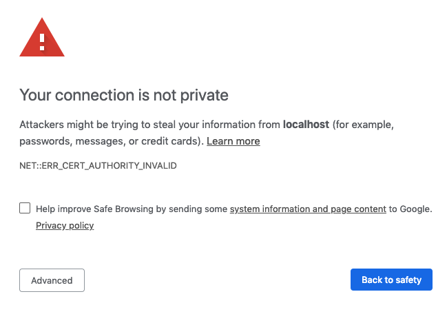
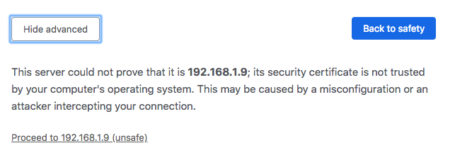

# Deploy on DigitalOcean

This tutorial shows you how to deploy `code-server` to a single node running on DigitalOcean.

If you're just starting out, we recommend [installing code-server locally](../../self-hosted/index.md). It takes only a few minutes and lets you try out all of the features. You can also try out the IDE on a container hosted [by Coder](http://coder.com/signup)

---

## Use the "Create Droplets" wizard

[Open your DigitalOcean dashboard](https://cloud.digitalocean.com/droplets/new) to create a new droplet

- **Choose an image -** Select the **Distributions** tab and then choose Ubuntu
- **Choose a size -** We recommend at least 4GB RAM and 2 CPU, more depending on team size and number of repositories/languages enabled.
- Launch your instance
- Open a terminal on your computer and SSH into your instance
  > example: ssh root@203.0.113.0
- Once in the SSH session, visit code-server [releases page](https://github.com/codercom/code-server/releases/) and copy the link to the download for the latest linux release
- Find the latest Linux release from this URL:
  ```
  https://github.com/codercom/code-server/releases/latest
  ```
- Replace {version} in the following command with the version found on the releases page and run it (or just copy the download URL from the releases page):
  ```
  wget https://github.com/codercom/code-server/releases/download/{version}/code-server-{version}-linux-x64.tar.gz
  ```
- Extract the downloaded tar.gz file with this command, for example:
  ```
  tar -xvzf code-server-{version}-linux-x64.tar.gz
  ```
- Navigate to extracted directory with this command:
  ```
  cd code-server-{version}-linux-x64
  ```
- If you run into any permission errors when attempting to run the binary:
  ```
  chmod +x code-server
  ```
  > To ensure the connection between you and your server is encrypted view our guide on [securing your setup](../../security/ssl.md)
- Finally start the code-server
  ```
  sudo ./code-server -p 80
  ```
    > For instructions on how to keep the server running after you end your SSH session please checkout [how to use systemd](https://www.linode.com/docs/quick-answers/linux/start-service-at-boot/) to start linux based services if they are killed
- When you visit the public IP for your Digital Ocean instance, you will be greeted with this page. Code-server is using a self-signed SSL certificate for easy setup. To proceed to the IDE, click **"Advanced"**
- Then click **"proceed anyway"**

---
> NOTE: If you get stuck or need help, [file an issue](https://github.com/codercom/code-server/issues/new?&title=Improve+self-hosted+quickstart+guide), [tweet (@coderhq)](https://twitter.com/coderhq) or [email](mailto:support@coder.com?subject=Self-hosted%20quickstart%20guide).
