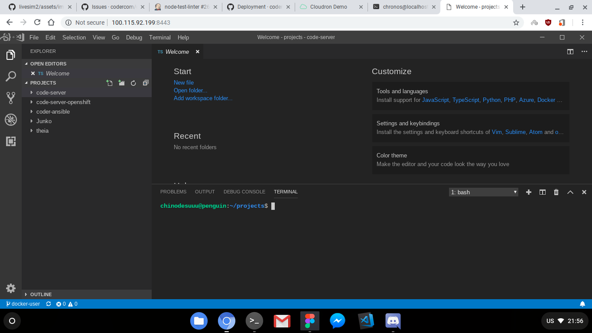

# Installing code-server in your ChromiumOS/ChromeOS/CloudReady machine

This guide will show you how to install code-server into your CrOS machine.

## Using Crostini

One of the easier ways to run code-server is via
[Crostini](https://www.aboutchromebooks.com/tag/project-crostini/), the Linux
apps support feature in CrOS. Make sure you have enough RAM, HDD space and your
CPU has VT-x/ AMD-V support. If your chromebook has this, then you are
qualified to use Crostini.

If you are running R69, you might want to enable this on
[Chrome Flags](chrome://flags/#enable-experimental-crostini-ui).
If you run R72, however, this is already enabled for you.

After checking your prerequisites, follow the steps in [the self-host install guide](index.md)
on installing code-server. Once done, make sure code-server works by running
it. After running it, simply go to `penguin.linux.test:8080` to access
code-server. Now you should be greeted with this screen. If you did,
congratulations, you have installed code-server in your Chromebook!



Alternatively, if you ran code-server in another container and you need the IP
for that specific container, simply go to Termina's shell via `crosh` and type
`vsh termina`.

```bash
Loading extra module: /usr/share/crosh/dev.d/50-crosh.sh
Welcome to crosh, the Chrome OS developer shell.

If you got here by mistake, don't panic!  Just close this tab and carry on.

Type 'help' for a list of commands.

If you want to customize the look/behavior, you can use the options page.
Load it by using the Ctrl+Shift+P keyboard shortcut.

crosh> vsh termina
(termina) chronos@localhost ~ $
```
While in termina, run `lxc list`. It should output the list of running containers.

```bash
(termina) chronos@localhost ~ $ lxc list
+---------|---------|-----------------------|------|------------|-----------+
|  NAME   |  STATE  |         IPV4          | IPV6 |    TYPE    | SNAPSHOTS |
+---------|---------|-----------------------|------|------------|-----------+
| penguin | RUNNING | 100.115.92.199 (eth0) |      | PERSISTENT | 0         |
+---------|---------|-----------------------|------|------------|-----------+
(termina) chronos@localhost ~ $
```

For this example, we show the default `penguin` container, which is exposed on
`eth0` at 100.115.92.199. Simply enter the IP of the container where the
code-server runs to Chrome.

## Using Crouton

[Crouton](https://github.com/dnschneid/crouton) is one of the old ways to get a
running full Linux via `chroot` on a Chromebook. To use crouton, enable
developer mode and go to `crosh`. This time, run `shell`, which should drop you
to `bash`.

Make sure you downloaded `crouton`, if so, go ahead and run it under
`~/Downloads`. After installing your chroot container via crouton, go ahead and
enter `enter-chroot` to enter your container.

Follow the instructions set in [the self-host install guide](index.md) to
install code-server. After that is done, run `code-server` and verify it works
by going to `localhost:8080`.

> At this point in writing, `localhost` seems to work in this method. However,
> the author is not sure if it applies still to newer Chromebooks.
