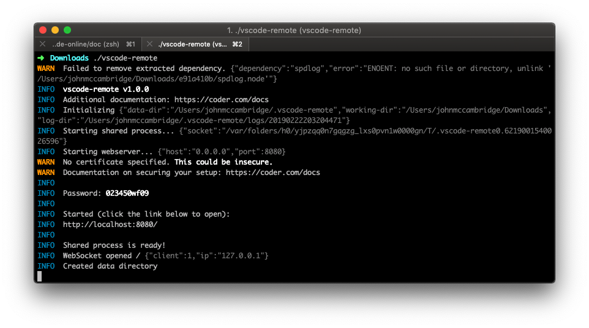
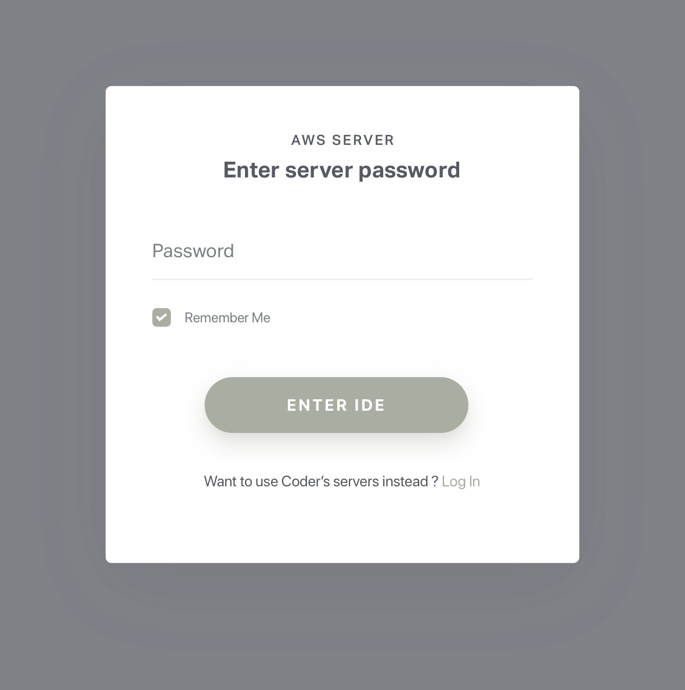

# Getting Started

[code-server](https://coder.com) is used by developers at Azure, Google, Reddit, and more to give them access to VS Code in the browser.

## Quickstart Guide

> NOTE: If you get stuck or need help, [file an issue](https://github.com/cdr/code-server/issues/new?&title=Improve+self-hosted+quickstart+guide), [tweet (@coderhq)](https://twitter.com/coderhq) or [email](mailto:support@coder.com?subject=Self-hosted%20quickstart%20guide).

This document pertains to Coder specific implementations of VS Code. For documentation on how to use VS Code itself, please refer to the official [documentation for VS Code](https://code.visualstudio.com/docs)

It takes just a few minutes to get your own self-hosted server running. If you've got a machine running macOS, Windows, or Linux, you're ready to start the binary which listens on port `8443` by default.

<!--
  DO NOT CHANGE THIS TO A CODEBLOCK.
  We want line breaks for readability, but backslashes to escape them do not work cross-platform.
  This uses line breaks that are rendered but not copy-pasted to the clipboard.
-->


1. Visit [the releases](https://github.com/cdr/code-server/releases) page and download the latest cli for your operating system
2. Double click the executable to run in the current directory
3. Copy the password that appears in the cli
4. In your browser navigate to `localhost:8443`
5. Paste the password from the cli into the login window
> NOTE: Be careful with your password as sharing it will grant those users access to your server's file system

### Things To Know
- When you visit the IP for your code-server instance, you will be greeted with a page similar to the following screenshot. Code-server is using a self-signed SSL certificate for easy setup. In Chrome/Chromium, click **"Advanced"** then click **"proceed anyway"**. In Firefox, click **Advanced**, then **Add Exception**, then finally **Confirm Security Exception**.

## Usage
<pre class="pre-wrap"><code>code-server<span class="virtual-br"></span> --help</code></pre>

code-server can be ran with a number of arguments to customize your working directory, host, port, and SSL certificate.

```
Usage: code-server [options]

Run VS Code on a remote server.

Options:
  -V, --version               output the version number
  --cert <value>
  --cert-key <value>
  -e, --extensions-dir <dir>  Set the root path for extensions.
  -d, --user-data-dir <dir>   Specifies the directory that user data is kept in, useful when running as root.
  --data-dir <value>          DEPRECATED: Use '--user-data-dir' instead. Customize where user-data is stored.
  -h, --host <value>          Customize the hostname. (default: "0.0.0.0")
  -o, --open                  Open in the browser on startup.
  -p, --port <number>         Port to bind on. (default: 8443)
  -N, --no-auth               Start without requiring authentication.
  -H, --allow-http            Allow http connections.
  -P, --password <value>      Specify a password for authentication.
  --disable-telemetry         Disables ALL telemetry.
  --help                      output usage information
  ```

  ### Data Directory
  Use `code-server -d (path/to/directory)` or `code-server --user-data-dir=(path/to/directory)`, excluding the parentheses to specify the root folder that VS Code will start in.

  ### Host
  By default, code-server will use `0.0.0.0` as its address. This can be changed by using `code-server -h` or `code-server --host=` followed by the address you want to use.
  > Example: `code-server -h 127.0.0.1`

  ### Open
  You can have the server automatically open the VS Code in your browser on startup by using the `code-server -o` or `code-server --open` flags

  ### Port
  By default, code-server will use `8443` as its port. This can be changed by using `code-server -p` or `code-server --port=` followed by the port you want to use.
  > Example: `code-server -p 9000`

  ### Telemetry
  Disable all telemetry with `code-server --disable-telemetry`.

  ### Cert and Cert Key
  To encrypt the traffic between the browser and server use `code-server --cert=` followed by the path to your `.cer` file. Additionally, you can use certificate keys with `code-server --cert-key` followed by the path to your `.key` file.
> Example (certificate and key): `code-server --cert /etc/letsencrypt/live/example.com/fullchain.cer --cert-key /etc/letsencrypt/live/example.com/fullchain.key`
> Example (if you are using Letsencrypt or similar): `code-server --cert /etc/letsencrypt/live/example.com/fullchain.pem --cert-key /etc/letsencrypt/live/example.com/privkey.key`

> To ensure the connection between you and your server is encrypted view our guide on [securing your setup](../security/ssl.md)

  ### Nginx Reverse Proxy
  Nginx is for reverse proxy. Below is a virtual host example that works with code-server. Please also pass --allow-http. You can also use certbot by EFF to get a ssl certificates for free.
  ```
  server {
    listen 80;
    listen [::]:80;
    server_name code.example.com code.example.org;
      location / {
         proxy_pass http://localhost:8443/;
         proxy_set_header Upgrade $http_upgrade;
         proxy_set_header Connection upgrade;
         proxy_set_header Accept-Encoding gzip;
      }
   }
  ```

  ### Apache Reverse Proxy
  Example of https virtualhost configuration for Apache as a reverse proxy. Please also pass --allow-http on code-server startup to allow the proxy to connect.
  ```
  <VirtualHost *:80>
    ServerName code.example.com

    RewriteEngine On
    RewriteCond %{HTTP:Upgrade} =websocket [NC]
    RewriteRule /(.*)           ws://localhost:8443/$1 [P,L]
    RewriteCond %{HTTP:Upgrade} !=websocket [NC]
    RewriteRule /(.*)           http://localhost:8443/$1 [P,L]

    ProxyRequests off

    RequestHeader set X-Forwarded-Proto https
    RequestHeader set X-Forwarded-Port 443

    ProxyPass / http://localhost:8443/ nocanon
    ProxyPassReverse / http://localhost:8443/

  </VirtualHost>
  ```
  *Important:* For more details about Apache reverse proxy configuration checkout the [documentation](https://httpd.apache.org/docs/current/mod/mod_proxy.html) - especially the [Securing your Server](https://httpd.apache.org/docs/current/mod/mod_proxy.html#access) section

  ### Help
  Use `code-server --help` to view the usage for the CLI. This is also shown at the beginning of this section.
