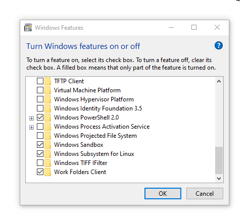
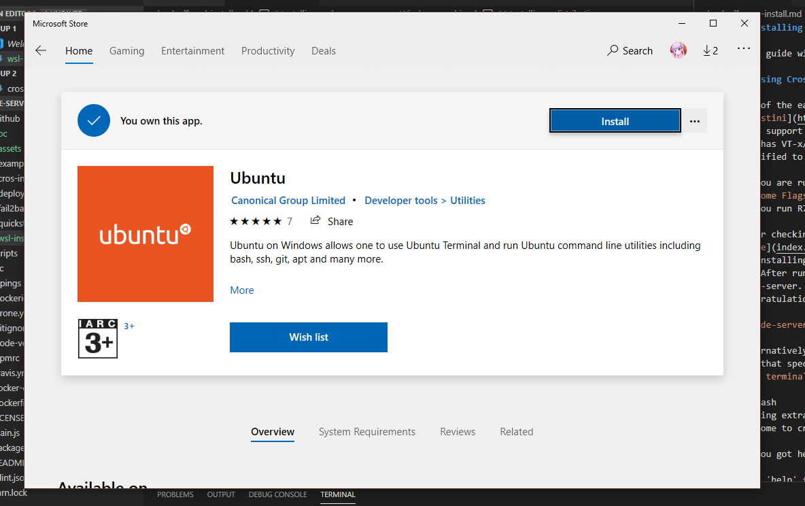

# Installing code-server on your Windows machine

This guide will show you how to install code-server on your Windows machine.

Unlike Linux or Chrome OS, Windows requires some extra steps before you can use code-server in your Windows machine.

## Prerequisites

Since code-server is primarily a Linux application, you will need to activate a Windows optional feature - [Windows Subsystem for Linux](https://docs.microsoft.com/en-us/windows/wsl/about). 

Before proceeding further in this guide, please enable Windows Subsystem for Linux by going to Settings > Apps and Features > Optional Features and enable Windows Subsystem for Linux.

> **Note**: If you wish to use Windows Subsystem for Linux 2, enable the virtualization platform. Which can be found on the same dialogue as well.

When prompted to restart, restart your machine and log in again.

## Installing a distribution

Windows Subsystem for Linux does not come with any distributions by default, it is merely a runtime for you to run Linux applications, but you'll need the guest operating system to do so.

Go to Microsoft Store and download a distribution for your Windows machine. For this guide, we will use Ubuntu.

Read the [documentation](https://docs.microsoft.com/en-us/windows/wsl/initialize-distro) on how to install your own distribution if you aim for a custom stack.

## Installing code-server

Since you have your distribution initialized, you will have to install code-server. Simply follow our [install guide](quickstart.md) to get you up to speed.

## Accessing code-server

Now that you are runnning code-server, you may now access code-server via `localhost:<port>`.

> **Note**: If you are using Windows Subsystem for Linux 2, your application won't be routed to localhost. 
>
> This is because Windows Subsystem for Linux 2 uses a virtualization approach, so you will be needing to access the application via a internal IP.
> 
> To know more, refer to the [documentation](https://docs.microsoft.com/en-us/windows/wsl/wsl2-ux-changes#accessing-network-applications).

