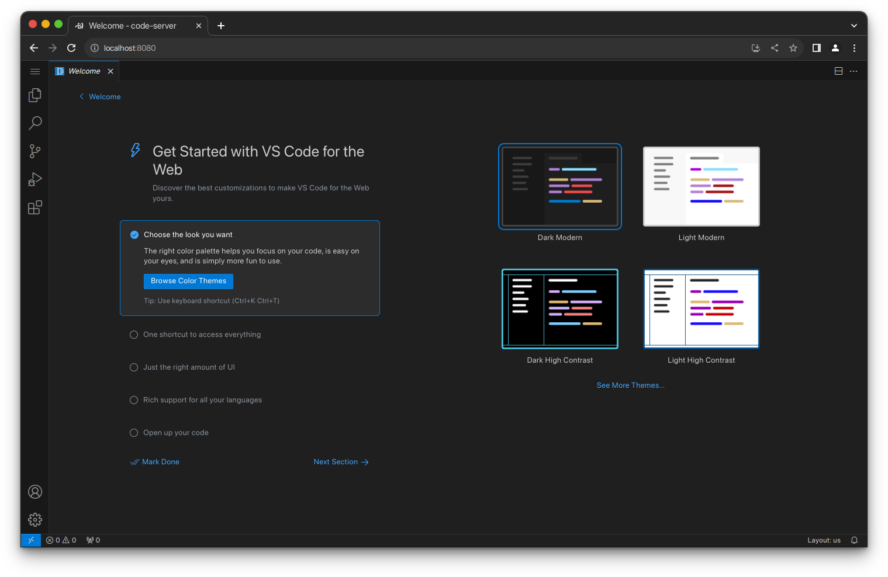

# code-server

[](https://github.com/coder/code-server/discussions) [](https://coder.com/community) [](https://twitter.com/coderhq) [](https://codecov.io/gh/coder/code-server) [](https://coder.com/docs/code-server/latest)

Run [VS Code](https://github.com/Microsoft/vscode) on any machine anywhere and
access it in the browser.




## Highlights

- Code on any device with a consistent development environment
- Use cloud servers to speed up tests, compilations, downloads, and more
- Preserve battery life when you're on the go; all intensive tasks run on your
  server

## Requirements

See [requirements](https://coder.com/docs/code-server/latest/requirements) for minimum specs, as well as instructions
on how to set up a Google VM on which you can install code-server.

**TL;DR:** Linux machine with WebSockets enabled, 1 GB RAM, and 2 vCPUs

## Getting started

There are four ways to get started:

1. Using the [install
   script](https://github.com/coder/code-server/blob/main/install.sh), which
   automates most of the process. The script uses the system package manager if
   possible.
2. Manually [installing
   code-server](https://coder.com/docs/code-server/latest/install)
3. Deploy code-server to your team with [coder/coder](https://cdr.co/coder-github)
4. Using our one-click buttons and guides to [deploy code-server to a cloud
   provider](https://github.com/coder/deploy-code-server) ⚡

If you use the install script, you can preview what occurs during the install
process:

```bash
curl -fsSL https://code-server.dev/install.sh | sh -s -- --dry-run
```

To install, run:

```bash
curl -fsSL https://code-server.dev/install.sh | sh
```

When done, the install script prints out instructions for running and starting
code-server.

> **Note**
> To manage code-server for a team on your infrastructure, see: [coder/coder](https://cdr.co/coder-github)

We also have an in-depth [setup and
configuration](https://coder.com/docs/code-server/latest/guide) guide.

## Questions?

See answers to [frequently asked
questions](https://coder.com/docs/code-server/latest/FAQ).

## Want to help?

See [Contributing](https://coder.com/docs/code-server/latest/CONTRIBUTING) for
details.

## Hiring

Interested in [working at Coder](https://coder.com/careers)? Check out [our open
positions](https://coder.com/careers#openings)!

## For Teams

We develop [coder/coder](https://cdr.co/coder-github) to help teams to
adopt remote development.
