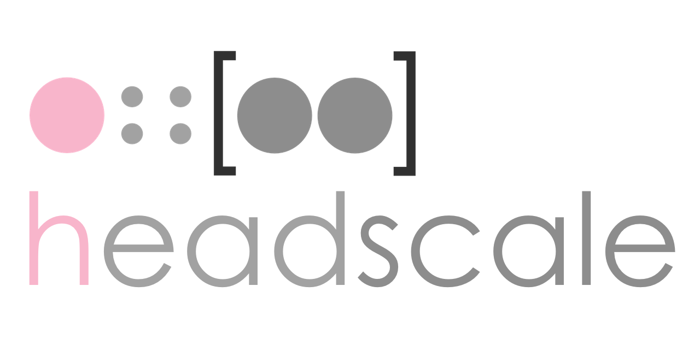

An open source, self-hosted implementation of the Tailscale control server.

Join our [Discord server](https://discord.gg/c84AZQhmpx) for a chat.

**Note:** Always select the same GitHub tag as the released version you use
to ensure you have the correct example configuration. The `main` branch might
contain unreleased changes. The documentation is available for stable and
development versions:

- [Documentation for the stable version](https://headscale.net/stable/)
- [Documentation for the development version](https://headscale.net/development/)

## What is Tailscale

Tailscale is [a modern VPN](https://tailscale.com/) built on top of
[Wireguard](https://www.wireguard.com/).
It [works like an overlay network](https://tailscale.com/blog/how-tailscale-works/)
between the computers of your networks - using
[NAT traversal](https://tailscale.com/blog/how-nat-traversal-works/).

Everything in Tailscale is Open Source, except the GUI clients for proprietary OS
(Windows and macOS/iOS), and the control server.

The control server works as an exchange point of Wireguard public keys for the
nodes in the Tailscale network. It assigns the IP addresses of the clients,
creates the boundaries between each user, enables sharing machines between users,
and exposes the advertised routes of your nodes.

A [Tailscale network (tailnet)](https://tailscale.com/kb/1136/tailnet/) is private
network which Tailscale assigns to a user in terms of private users or an
organisation.

## Design goal

Headscale aims to implement a self-hosted, open source alternative to the
[Tailscale](https://tailscale.com/) control server. Headscale's goal is to
provide self-hosters and hobbyists with an open-source server they can use for
their projects and labs. It implements a narrow scope, a _single_ Tailscale
network (tailnet), suitable for a personal use, or a small open-source
organisation.

## Supporting Headscale

If you like `headscale` and find it useful, there is a sponsorship and donation
buttons available in the repo.

## Features

Please see ["Features" in the documentation](https://headscale.net/stable/about/features/).

## Client OS support

Please see ["Client and operating system support" in the documentation](https://headscale.net/stable/about/clients/).

## Running headscale

**Please note that we do not support nor encourage the use of reverse proxies
and container to run Headscale.**

Please have a look at the [`documentation`](https://headscale.net/stable/).

## Talks

- Fosdem 2023 (video): [Headscale: How we are using integration testing to reimplement Tailscale](https://fosdem.org/2023/schedule/event/goheadscale/)
  - presented by Juan Font Alonso and Kristoffer Dalby

## Disclaimer

This project is not associated with Tailscale Inc.

However, one of the active maintainers for Headscale [is employed by Tailscale](https://tailscale.com/blog/opensource) and he is allowed to spend work hours contributing to the project. Contributions from this maintainer are reviewed by other maintainers.

The maintainers work together on setting the direction for the project. The underlying principle is to serve the community of self-hosters, enthusiasts and hobbyists - while having a sustainable project.

## Contributing

Please read the [CONTRIBUTING.md](./CONTRIBUTING.md) file.

### Requirements

To contribute to headscale you would need the latest version of [Go](https://golang.org)
and [Buf](https://buf.build) (Protobuf generator).

We recommend using [Nix](https://nixos.org/) to setup a development environment. This can
be done with `nix develop`, which will install the tools and give you a shell.
This guarantees that you will have the same dev env as `headscale` maintainers.

### Code style

To ensure we have some consistency with a growing number of contributions,
this project has adopted linting and style/formatting rules:

The **Go** code is linted with [`golangci-lint`](https://golangci-lint.run) and
formatted with [`golines`](https://github.com/segmentio/golines) (width 88) and
[`gofumpt`](https://github.com/mvdan/gofumpt).
Please configure your editor to run the tools while developing and make sure to
run `make lint` and `make fmt` before committing any code.

The **Proto** code is linted with [`buf`](https://docs.buf.build/lint/overview) and
formatted with [`clang-format`](https://clang.llvm.org/docs/ClangFormat.html).

The **rest** (Markdown, YAML, etc) is formatted with [`prettier`](https://prettier.io).

Check out the `.golangci.yaml` and `Makefile` to see the specific configuration.

### Install development tools

- Go
- Buf
- Protobuf tools

Install and activate:

```shell
nix develop
```

### Testing and building

Some parts of the project require the generation of Go code from Protobuf
(if changes are made in `proto/`) and it must be (re-)generated with:

```shell
make generate
```

**Note**: Please check in changes from `gen/` in a separate commit to make it easier to review.

To run the tests:

```shell
make test
```

To build the program:

```shell
make build
```

### Development workflow

We recommend using Nix for dependency management to ensure you have all required tools. If you prefer to manage dependencies yourself, you can use Make directly:

**With Nix (recommended):**
```shell
nix develop
make test
make build
```

**With your own dependencies:**
```shell
make test
make build
```

The Makefile will warn you if any required tools are missing and suggest running `nix develop`. Run `make help` to see all available targets.

## Contributors

<a href="https://github.com/juanfont/headscale/graphs/contributors">
  
</a>

Made with [contrib.rocks](https://contrib.rocks).
