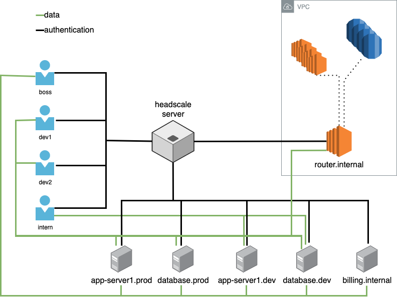

Headscale implements the same policy ACLs as Tailscale.com, adapted to the self-hosted environment.

For instance, instead of referring to users when defining groups you must
use users (which are the equivalent to user/logins in Tailscale.com).

Please check https://tailscale.com/kb/1018/acls/ for further information.

When using ACL's the User borders are no longer applied. All machines
whichever the User have the ability to communicate with other hosts as
long as the ACL's permits this exchange.

## ACLs use case example

Let's build an example use case for a small business (It may be the place where
ACL's are the most useful).

We have a small company with a boss, an admin, two developers and an intern.

The boss should have access to all servers but not to the user's hosts. Admin
should also have access to all hosts except that their permissions should be
limited to maintaining the hosts (for example purposes). The developers can do
anything they want on dev hosts but only watch on productions hosts. Intern
can only interact with the development servers.

There's an additional server that acts as a router, connecting the VPN users
to an internal network `10.20.0.0/16`. Developers must have access to those
internal resources.

Each user have at least a device connected to the network and we have some
servers.

- database.prod
- database.dev
- app-server1.prod
- app-server1.dev
- billing.internal
- router.internal



## ACL setup

ACLs have to be written in [huJSON](https://github.com/tailscale/hujson).

When [registering the servers](../usage/getting-started.md#register-a-node) we
will need to add the flag `--advertise-tags=tag:<tag1>,tag:<tag2>`, and the user
that is registering the server should be allowed to do it. Since anyone can add
tags to a server they can register, the check of the tags is done on headscale
server and only valid tags are applied. A tag is valid if the user that is
registering it is allowed to do it.

To use ACLs in headscale, you must edit your `config.yaml` file. In there you will find a `policy.path` parameter. This
will need to point to your ACL file. More info on how these policies are written can be found
[here](https://tailscale.com/kb/1018/acls/).

Please reload or restart Headscale after updating the ACL file. Headscale may be reloaded either via its systemd service
(`sudo systemctl reload headscale`) or by sending a SIGHUP signal (`sudo kill -HUP $(pidof headscale)`) to the main
process. Headscale logs the result of ACL policy processing after each reload.

Here are the ACL's to implement the same permissions as above:

```json title="acl.json"
{
  // groups are collections of users having a common scope. A user can be in multiple groups
  // groups cannot be composed of groups
  "groups": {
    "group:boss": ["boss@"],
    "group:dev": ["dev1@", "dev2@"],
    "group:admin": ["admin1@"],
    "group:intern": ["intern1@"]
  },
  // tagOwners in tailscale is an association between a TAG and the people allowed to set this TAG on a server.
  // This is documented [here](https://tailscale.com/kb/1068/acl-tags#defining-a-tag)
  // and explained [here](https://tailscale.com/blog/rbac-like-it-was-meant-to-be/)
  "tagOwners": {
    // the administrators can add servers in production
    "tag:prod-databases": ["group:admin"],
    "tag:prod-app-servers": ["group:admin"],

    // the boss can tag any server as internal
    "tag:internal": ["group:boss"],

    // dev can add servers for dev purposes as well as admins
    "tag:dev-databases": ["group:admin", "group:dev"],
    "tag:dev-app-servers": ["group:admin", "group:dev"]

    // interns cannot add servers
  },
  // hosts should be defined using its IP addresses and a subnet mask.
  // to define a single host, use a /32 mask. You cannot use DNS entries here,
  // as they're prone to be hijacked by replacing their IP addresses.
  // see https://github.com/tailscale/tailscale/issues/3800 for more information.
  "hosts": {
    "postgresql.internal": "10.20.0.2/32",
    "webservers.internal": "10.20.10.1/29"
  },
  "acls": [
    // boss have access to all servers
    {
      "action": "accept",
      "src": ["group:boss"],
      "dst": [
        "tag:prod-databases:*",
        "tag:prod-app-servers:*",
        "tag:internal:*",
        "tag:dev-databases:*",
        "tag:dev-app-servers:*"
      ]
    },

    // admin have only access to administrative ports of the servers, in tcp/22
    {
      "action": "accept",
      "src": ["group:admin"],
      "proto": "tcp",
      "dst": [
        "tag:prod-databases:22",
        "tag:prod-app-servers:22",
        "tag:internal:22",
        "tag:dev-databases:22",
        "tag:dev-app-servers:22"
      ]
    },

    // we also allow admin to ping the servers
    {
      "action": "accept",
      "src": ["group:admin"],
      "proto": "icmp",
      "dst": [
        "tag:prod-databases:*",
        "tag:prod-app-servers:*",
        "tag:internal:*",
        "tag:dev-databases:*",
        "tag:dev-app-servers:*"
      ]
    },

    // developers have access to databases servers and application servers on all ports
    // they can only view the applications servers in prod and have no access to databases servers in production
    {
      "action": "accept",
      "src": ["group:dev"],
      "dst": [
        "tag:dev-databases:*",
        "tag:dev-app-servers:*",
        "tag:prod-app-servers:80,443"
      ]
    },
    // developers have access to the internal network through the router.
    // the internal network is composed of HTTPS endpoints and Postgresql
    // database servers.
    {
      "action": "accept",
      "src": ["group:dev"],
      "dst": ["10.20.0.0/16:443,5432"]
    },

    // servers should be able to talk to database in tcp/5432. Database should not be able to initiate connections to
    // applications servers
    {
      "action": "accept",
      "src": ["tag:dev-app-servers"],
      "proto": "tcp",
      "dst": ["tag:dev-databases:5432"]
    },
    {
      "action": "accept",
      "src": ["tag:prod-app-servers"],
      "dst": ["tag:prod-databases:5432"]
    },

    // interns have access to dev-app-servers only in reading mode
    {
      "action": "accept",
      "src": ["group:intern"],
      "dst": ["tag:dev-app-servers:80,443"]
    },

    // We still have to allow internal users communications since nothing guarantees that each user have
    // their own users.
    { "action": "accept", "src": ["boss@"], "dst": ["boss@:*"] },
    { "action": "accept", "src": ["dev1@"], "dst": ["dev1@:*"] },
    { "action": "accept", "src": ["dev2@"], "dst": ["dev2@:*"] },
    { "action": "accept", "src": ["admin1@"], "dst": ["admin1@:*"] },
    { "action": "accept", "src": ["intern1@"], "dst": ["intern1@:*"] }
  ]
}
```
